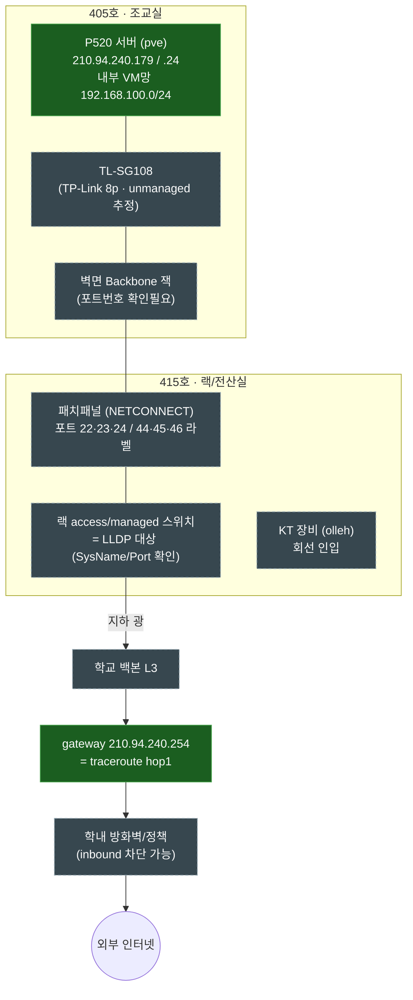

---
title: "SU Cloud — 학내망 경로 추적 Runbook"
type: "raw"
date: 2026-06-21
tags: ["#raw", "#inbox"]
status: "raw"
source: "notion-export"
promoted_to: ""
---
# SU Cloud — 학내망 경로 추적 Runbook

> **목적**: 운영계 후보 서버 **P520**(현재 Proxmox `pve`)에서 출발해 `TL-SG108 → 조교실 벽면 → 1실습관 랙 → 학교 백본 → gateway .254 → 외부`로 이어지는 물리·논리 경로를 직접 관측하고, 할당 공인 IP `210.94.240.179~180`이 외부에서 실제로 돌아오는지(inbound)까지 검증한다.
> 
> 
> **상태**: 통합본 (기존 runbook + 405/415호 사진 + 현장 스크린샷 + netscan.sh 합본) · 이게 단일 소스.
> 

## 1. 학교 네트워크 구조 파악

### 백본 (Backbone)

네트워크의 **중심 고속도로**. 건물과 건물, 층과 층을 연결하는 핵심 회선.

```
[인터넷]
    │
  학교 백본 스위치 (고속, 고용량)
  /        |        \
건물A    건물B    건물C
  │        │        │
층별 스위치 → 각 방의 PC, 서버
```

백본이 막히거나 느리면 학교 전체 네트워크가 느려짐. Proxmox 서버도 결국 이 백본을 타고 인터넷에 나감.

### VLAN (Virtual LAN)

물리적으로는 같은 스위치에 연결돼 있어도 **논리적으로 네트워크를 분리**하는 기술.

```
물리적으로는 하나의 스위치
    │
    ├── VLAN 10: 교수 네트워크
    ├── VLAN 20: 학생 네트워크
    └── VLAN 30: 서버 네트워크
```

VLAN이 다르면 같은 스위치에 꽂혀 있어도 서로 통신이 안됨. 보안과 트래픽 분리가 목적.

학교 보안 스위치가 포트를 차단했던 것도 VLAN 정책 때문일 가능성이 높음.

### 패킷 트레이싱 — hop이 몇 개인지 파악하기

패킷이 목적지까지 가면서 거치는 라우터/스위치 하나하나를 **hop**이라고 함.

```bash
# traceroute로 hop 확인
traceroute 8.8.8.8

# 결과 예시
1  192.168.100.1   (Proxmox vmnet 게이트웨이)
2  210.94.240.254  (학교 라우터)
3  xxx.xxx.xxx.xxx (학교 백본)
4  ...
n  8.8.8.8         (구글 DNS)
```

hop이 많을수록 지연(latency)이 커짐. 어느 구간에서 느린지 파악할 수 있음.

```bash
# OpenStack VM 안에서도 확인 가능
ssh cirros@192.168.100.243
traceroute 8.8.8.8

# Proxmox 호스트에서
traceroute 8.8.8.8
```

VM에서 나가는 hop과 Proxmox 호스트에서 나가는 hop을 비교하면 OVN이 몇 개의 hop을 추가하는지 파악할 수 있음.

---

## 0. 정보 확인

| 항목 | 값 | 출처/상태 |
| --- | --- | --- |
| 대상 서버 | **P520** (Lenovo ThinkStation, 현재 Proxmox `pve`) | 사진·라벨 |
| 위치 | 1실습관 **405호 조교실** (서버·TL-SG108·벽면 Backbone 잭) | 사진 |
| 랙/전산실 | 1실습관 **415호** (분배 스위치·패치패널·KT 장비) | 사진 |
| 호스트 IP | `210.94.240.179` / `255.255.255.0` | ✅ `ip route`, `arp-scan` |
| Gateway | `210.94.240.254` | ✅ `ip route`, traceroute hop1 |
| 할당 공인 IP | `210.94.240.179~180` (2개) | ✅ |
| 내부 VM망 | `192.168.100.0/24` (Proxmox vmbr1) | ✅ 스크린샷 |
| 외부 도달성(out) | `8.8.8.8` traceroute/mtr 정상, Loss 0% | ✅ 스크린샷 |

**아직 미검증 (이번 세션 목표):**

- [ ]  조교실↔랙 **L2 경로** = 어느 스위치/포트에 매달려 있나 (LLDP)
- [ ]  포트 성격 = **access vs trunk**, 운영계 VLAN이 같은 포트로 오는가
- [ ]  **inbound**: 외부 → `.179/.180`이 방화벽 넘어 실제로 닿는가
- [ ]  호스트 내부 **NAT/포워딩**이 의도대로 동작하는가

> 별개 컨텍스트: **개발계(Gaming5)** 는 `10.20.110.0/24 VLAN 110`으로 분리됨. 이 문서는 **운영계(P520, 공인망)** 만 다룬다.
> 

---

## 1. 구조도

### 1.1 물리 + 논리 (end-to-end)



> 초록 = 확인됨 · 회색 점선 = 검증 대상
> 

```
405호 조교실                       415호 랙              백본/관문        외부
───────────                       ────────             ────────        ────
P520(pve) ── TL-SG108 ── 벽면잭 ── [랙 스위치] ─광─ [백본L3] ─ .254 ─ [방화벽] ─ 인터넷
.179/.24                  └ L2 (traceroute 안 보임) ┘   └ hop1 ┘   └ inbound? ┘
                          ↑ LLDP로 식별                            ↑ 외부 vantage로 검증
```

### 1.2 핵심 개념 — traceroute는 L3만 보임

> **traceroute / mtr는 L3(IP) hop만 보여준다. 중간 L2 스위치(TL-SG108, 랙 access switch)는 hop으로 안 나타남.**
> 

traceroute는 TTL(Time To Live)을 1부터 하나씩 늘려가며 패킷을 보내는 방식으로 경로를 파악. 각 라우터(L3 장비)는 TTL을 1 감소시키고 TTL이 0이 되면 "TTL exceeded" 메시지를 보낸다. 이 메시지를 통해 hop을 확인.

TL-SG108이나 랙 L2 스위치는 TTL을 감소시키지 않기 때문에 traceroute에 안 잡히는 게 정상. hop1이 바로 `210.94.240.254`(gateway)로 나오는 이유가 이것. 조교실~랙 물리 구간은 L2 도구(LLDP / ARP / 케이블 추적)로 따로 봐야 함.

네트워크 계층별로 보는 도구가 나뉨.

| 보고 싶은 것 | 도구 | 한계 |
| --- | --- | --- |
| 외부 L3 경로 | `traceroute`, `mtr` | L2 안 보임, ICMP 차단 시 별표 |
| 경로 품질(손실/지연) | `mtr` 연속측정 | hop별 rate-limit 주의 |
| 바로 위 L2 스위치 | `lldpctl`, `tcpdump` | 스위치가 LLDP off면 안 보임 |
| 같은 L2 이웃 | `ip neigh`, `arp-scan -l` | broadcast domain 한정 |
| `.179/.180` inbound | **외부** vantage→우리 | 비대칭 경로·방화벽 |
| 호스트 NAT 경로 | `conntrack`, `nft`, `iptables -t nat` | 호스트 내부만 |

---

## 2. 권한 경계 (먼저 읽기)

원칙: **"내 서버에서 바깥으로 나가는 경로를 본다"는 OK, "남의 호스트를 훑는다"는 승인 전까지 금지.**

| 구분 | 작업 | 협의 |
| --- | --- | --- |
| 🟢 안전 | 내 호스트 `ip/route/neigh`, 알려진 목적지(`.254`, `8.8.8.8`) traceroute/mtr, passive `tcpdump`(LLDP/VLAN), 내 호스트 conntrack/nat 관찰 | 불필요(기록만) |
| 🟡 주의 | 상위 스위치 포트 모드/VLAN 변경, VLAN subif 테스트, 케이블 추적 | 전산실/조교 협의 |
| 🔴 금지 | 타 학과·오피스망 호스트 능동 포트스캔(`nmap -p-`), 서비스 enumeration, 임의 VLAN ID 스위핑 | **전산실 승인 필수** |

---

## 3. 현장 조사 순서

> 빠르게 한 번에: 아래 자동화 스크립트로 3.1~3.4·3.6을 일괄 수집(→ 4장). 이후 3.5(inbound)는 외부에서 별도 수행.
> 

### 3.1 내 위치 확정

```bash
ip -br link ; ip -br addr
ip route ; ip route get 8.8.8.8
ip neigh
resolvectl status
curl -4 --max-time 8 https://ifconfig.me ; echo
```

**명령어 해설**

`ip -br link` / `ip -br addr` — 이 서버에 달려있는 NIC 목록과 각 인터페이스에 할당된 IP를 간결하게 출력한다. `-br`은 brief 출력 옵션. 어떤 인터페이스가 있고 어떤 IP가 붙어있는지 파악하는 첫 단계다.

`ip route` — 라우팅 테이블 전체 출력. 어떤 목적지로 가는 패킷이 어느 인터페이스와 게이트웨이로 나가는지 보여준다. `default via 210.94.240.254 dev eno1`이 보이면 기본 경로가 정상이다.

`ip route get 8.8.8.8` — "8.8.8.8로 패킷을 보낼 때 실제로 어떤 경로를 타는가"를 커널에게 직접 물어보는 명령어. 단순 테이블 조회가 아니라 커널이 실제로 선택할 경로를 알려준다. 출력에서 src IP, 인터페이스, 게이트웨이를 한 번에 확인할 수 있다.

```
8.8.8.8 via 210.94.240.254 dev eno1 src 210.94.240.179
```

`ip neigh` — ARP 테이블 출력. 같은 L2 네트워크(같은 스위치)에 연결된 이웃 장비의 IP↔MAC 매핑을 보여준다. 게이트웨이(`.254`)의 MAC이 보이면 L2 연결이 정상이라는 의미다.

`resolvectl status` — DNS 설정 확인. 학교망에서 특정 DNS 서버를 강제로 쓰게 할 수도 있다. 나중에 서비스 도메인 설정 시 참고가 된다.

`curl -4 --max-time 8 https://ifconfig.me` — 외부에서 봤을 때 이 서버의 공인 IP 확인. NAT 없이 공인 IP로 직결되어 있다면 `210.94.240.179`가 그대로 나와야 한다.

| 관찰 | 의미 |
| --- | --- |
| 내 IP=`210.94.240.179` & `ifconfig.me`도 동일 | **public VLAN 직결** → provider network 후보로 좋음 |
| 내 IP=사설(`192.168/10/172.16~31`), `ifconfig.me`는 다른 public | NAT 뒤 |
| `route get`의 gw=`210.94.240.254` | 우리 gateway로 직접 나감 |

---

### 3.2 아웃바운드 L3 (traceroute/mtr 심화)

> 방화벽이 프로토콜별로 다르게 통과시키므로 **모드 전환이 핵심**.
> 

```bash
traceroute -n 8.8.8.8                  # 기본(UDP)
sudo traceroute -n -I 8.8.8.8          # ICMP (UDP 막힐 때)
sudo traceroute -n -T -p 443 8.8.8.8   # TCP443 (방화벽 우회 최강)
traceroute -n -A 8.8.8.8               # AS 번호(어느 망 경유)
mtr -n -r -c 100 8.8.8.8               # 연속 측정 리포트(로그용)
mtr -n -r -c 50 210.94.240.254         # gateway 구간 품질만
```

**명령어 해설**

`traceroute -n 8.8.8.8` — 기본값은 UDP 패킷을 사용한다. `-n`은 DNS 역방향 조회 생략(속도 향상). 학교 방화벽이 UDP를 차단하면 전체가 `* * *`로 보인다.

`sudo traceroute -n -I 8.8.8.8` — `-I`는 ICMP echo를 사용한다. ping과 같은 프로토콜이라 UDP보다 방화벽을 통과하기 쉬운 경우가 많다. UDP가 막힐 때 시도한다. root 권한이 필요해서 `sudo`가 붙는다.

`sudo traceroute -n -T -p 443 8.8.8.8` — `-T`는 TCP SYN 패킷, `-p 443`은 HTTPS 포트. 방화벽이 HTTPS 트래픽은 허용하는 경우가 많아서 가장 통과하기 쉽다. UDP와 ICMP 모두 막힐 때 최후 수단.

`traceroute -n -A 8.8.8.8` — 각 hop이 어느 AS(자율 시스템, 즉 어느 망 사업자)에 속하는지 보여준다. 학교 망 → KT → Google 같은 경로를 AS 번호로 확인할 수 있다.

`mtr -n -r -c 100 8.8.8.8` — traceroute의 발전형. 100번 반복 측정해서 hop별 패킷 손실률(Loss%)과 지연(Avg ms)을 통계로 보여준다. `-r`은 리포트 모드(한 번 출력 후 종료), `-c 100`은 100회 측정.

`mtr -n -r -c 50 210.94.240.254` — 게이트웨이 구간만 집중 측정. 외부 인터넷 변수 없이 학교 내부 구간 품질만 확인할 때 쓴다.

**별표(`* * *`) 해석**

중간에 `* * *`가 나와도 **목적지(8.8.8.8)까지 도달하면 정상**이다. 해당 라우터가 TTL exceeded 메시지를 보안상 차단했을 뿐이다. 목적지 포함 이후로 전부 `* * *`이면 그 지점부터 실제로 차단된 것이다.

```
hop1: 210.94.240.254    ← 게이트웨이, 정상
hop2: * * *             ← 이 라우터가 TTL exceeded 안 보냄 (정상일 수 있음)
hop3: * * *
hop4: 8.8.8.8           ← 목적지 도달 → 전체 정상
```

UDP는 막히는데 `-T -p 443`은 뚫리면 → **방화벽이 443만 허용** (서비스 포트 정책에 직접 반영).

**mtr Loss% 해석**

- 중간 hop Loss↑인데 마지막 0% → ICMP rate-limit (실손실 아님, 무시)
- 특정 hop부터 끝까지 Loss↑ → 그 hop부터 실제 문제

---

### 3.3 ⭐ L2 상위 식별 (LLDP) — 가장 중요

```bash
sudo apt-get install -y lldpd && sudo systemctl restart lldpd
sleep 40        # LLDP 광고 주기(~30s) 대기
lldpctl         # SysName(스위치)/PortID(포트)/VLAN
# 데몬 없이 프레임만:
sudo tcpdump -i <iface> -nn -e -v '(ether proto 0x88cc) or (ether dst 01:00:0c:cc:cc:cc)'
```

**명령어 해설**

LLDP(Link Layer Discovery Protocol)는 L2 장비들이 서로 "나는 어떤 스위치의 어떤 포트에 연결되어 있다"는 정보를 주기적으로 방송하는 프로토콜이다. IP 없이 이더넷 레벨에서 동작한다.

```
P520 ── TL-SG108 ── 벽면잭 ── 랙 스위치
                              └ 이 스위치가 "나는 core-sw-415의 Gi0/12야" 광고
                                → P520에서 lldpctl로 수신
```

`lldpd` 데몬을 설치하면 P520이 LLDP 프레임을 수신하기 시작한다. 광고 주기가 약 30초이므로 `sleep 40`으로 충분히 기다린 후 `lldpctl`로 확인한다.

`lldpctl` 출력 예시:

```
Interface: eno1, via: LLDP
  Chassis:
    SysName: core-sw-415        ← 연결된 스위치 이름
    SysDescr: Cisco Catalyst 2960
  Port:
    PortID: GigabitEthernet0/12 ← 이 서버가 꽂힌 스위치 포트
    VLAN:   100
```

SysName과 PortID가 나오면 전산실에 물어볼 질문의 절반이 자동으로 해결된다.

`tcpdump` 명령에서 `0x88cc`는 LLDP 이더타입, `01:00:0c:cc:cc:cc`는 Cisco CDP 멀티캐스트 주소다. 데몬 설치 없이 날것의 프레임을 직접 캡처할 때 쓴다.

잡으면 → 전산실에 물어볼 질문 절반이 자동 해결(어느 스위치·포트).
안 잡히면 → TL-SG108이 unmanaged라 패스했거나 스위치 LLDP off → **케이블 추적(toner)** 또는 전산실 문의.

---

### 3.4 VLAN 성격 (access vs trunk)

```bash
sudo tcpdump -i <iface> -e -nn -c 50 vlan       # passive: tag 보이나
# (승인된 VID만) subinterface 검증:
sudo ip link add link <iface> name <iface>.<VID> type vlan id <VID>
sudo ip link set <iface>.<VID> up
sudo dhclient -v <iface>.<VID>                  # IP 받으면 trunk
sudo ip link del <iface>.<VID>                  # 반드시 정리
```

**명령어 해설**

포트 성격은 두 가지다.

- **Access 포트**: 하나의 VLAN만 전달. 이더넷 프레임에 VLAN 태그 없음.
- **Trunk 포트**: 여러 VLAN을 802.1Q 태그와 함께 전달. 프레임 안에 VLAN ID가 담겨있음.

운영계 VLAN과 VM 트래픽을 같은 물리 포트로 받으려면 trunk여야 한다. 물리 케이블 한 개로 여러 VLAN을 분리할 수 있는지 확인하는 단계다.

`tcpdump -i <iface> -e -nn -c 50 vlan` — passive 캡처. 이미 이 인터페이스로 VLAN 태그가 붙은 프레임이 들어오는지 50개 패킷만 확인한다. 아무것도 안 건드리고 보기만 한다.

`ip link add link eno1 name eno1.100 type vlan id 100` — 물리 인터페이스 위에 VLAN 100번 subinterface를 만든다. 이 subinterface로 들어오는 패킷은 VLAN 100 태그가 붙은 것만 처리한다.

`dhclient -v eno1.100` — subinterface에서 DHCP로 IP를 받아본다. IP가 할당되면 이 VLAN이 trunk로 내려오고 있다는 뜻이다.

> subinterface는 테스트 후 반드시 `ip link del`로 삭제한다. 남겨두면 의도치 않은 트래픽이 발생한다.
> 
- tag 안 보임 → access 가능성 / 특정 tag 보임 → trunk. 운영계 VLAN이 같은 포트로 오면 케이블 1개로 분리 가능.

---

### 3.5 Inbound 검증 — `.179/.180`이 진짜 돌아오는가

> **핵심은 vantage(관측 지점)를 학교망 밖에 두는 것.** 나가는 건 돼도 외부→우리 route가 없으면 공인 IP는 무의미.
> 

| vantage | 방법 | 비고 |
| --- | --- | --- |
| 클라우드 VM (AWS/GCP/KakaoCloud) | 거기서 우리 IP로 mtr/traceroute | 가장 깔끔, 계정 보유 |
| 휴대폰 LTE 테더링 | 캠퍼스망과 분리 경로 | 1차 확인 |
| Tailscale exit | overlay 경유 | 순수 public 검증엔 부적합(우회) |

```bash
# (학교망 밖에서) 우리 public IP로
mtr -n -r -c 50 210.94.240.179
traceroute -n -T -p 443 210.94.240.180
# 도달성: P520에 잠깐 서비스 올리고 외부에서 curl
#   P520:  sudo python3 -m http.server 80 --bind 210.94.240.180
#   외부:  curl -v http://210.94.240.180/
```

**명령어 해설**

캠퍼스망 안에서 `.179`로 traceroute를 보내면 내부 경로를 타기 때문에 외부 인터넷에서의 실제 inbound 경로를 검증할 수 없다. 반드시 캠퍼스망 밖 지점에서 보내야 한다.

`mtr -n -r -c 50 210.94.240.179` — 외부 vantage에서 우리 서버 방향으로 50회 측정. 어느 hop까지 오는지, 어디서 막히는지 확인한다.

`python3 -m http.server 80 --bind 210.94.240.180` — P520에서 `.180` IP로 임시 HTTP 서버를 올린다. 외부에서 `curl`로 접근해서 응답이 오면 inbound 완전 동작이다.

외부→`.180`이 `.254` 부근까지 오면 inbound route 살아있음.
마지막 1~2 hop에서 멈추면 → 방화벽/ARP 정책 차단 → 전산실 inbound 정책 질의.

> 검증용 임시 서비스(`http.server`)는 확인 후 즉시 종료한다.
> 

**비대칭 경로 주의**: 도달성 판단은 "외부→우리" 방향 결과로만 해야 한다. 나가는 경로(우리→외부)와 들어오는 경로(외부→우리)는 다를 수 있다.

---

### 3.6 호스트 내부 NAT/포워딩

```bash
sudo iptables -t nat -L -n -v          # SNAT/DNAT/MASQUERADE
sudo nft list table ip nat             # nft 환경
sudo conntrack -L                      # 현재 NAT 세션(src↔dst 변환 확인)
ss -tunap                              # 듣는/연결 소켓
# 실시간 패킷 경로 trace (ICMP 예):
sudo nft add table inet trace_tbl
sudo nft add chain inet trace_tbl prerouting '{ type filter hook prerouting priority -300; }'
sudo nft add rule inet trace_tbl prerouting ip protocol icmp meta nftrace set 1
sudo nft monitor trace
sudo nft delete table inet trace_tbl   # 반드시 정리
```

**명령어 해설**

`sudo iptables -t nat -L -n -v` — iptables의 NAT 테이블을 출력한다. `-t nat`은 NAT 테이블, `-L`은 전체 출력, `-n`은 숫자 출력(DNS 조회 생략), `-v`는 상세 출력. MASQUERADE 규칙이 있어야 VM(`192.168.100.0/24`)이 인터넷으로 나갈 수 있다.

```
Chain POSTROUTING
MASQUERADE  all  192.168.100.0/24  anywhere   ← VM망 → 공인 IP로 SNAT
```

`sudo nft list table ip nat` — 최신 Linux는 iptables 대신 nftables를 쓰는 경우가 있다. 같은 NAT 규칙을 nft 문법으로 확인한다. Proxmox 환경에서는 두 가지가 혼재할 수 있으므로 양쪽 다 확인한다.

`sudo conntrack -L` — 현재 활성화된 NAT 세션 목록을 실시간으로 보여준다. 실제로 패킷이 어떻게 변환되고 있는지 직접 확인할 수 있다. 포워딩 규칙이 의도대로 동작하는지 변환 항목으로 검증한다.

```
tcp  ESTABLISHED
  src=192.168.100.2 dst=8.8.8.8 sport=54321 dport=443
  src=8.8.8.8 dst=210.94.240.179 sport=443 dport=54321
```

VM(`192.168.100.2`)이 `8.8.8.8`로 보낸 패킷이 `210.94.240.179`로 SNAT된 세션이다.

`ss -tunap` — 현재 열려있는 소켓 목록. `-t` TCP, `-u` UDP, `-n` 숫자 출력, `-a` 모든 상태, `-p` 프로세스 이름. 어떤 서비스가 어떤 IP:포트에서 듣고 있는지 확인하고, 의도하지 않은 포트가 열려있지 않은지 검증한다.

`nft add table inet trace_tbl` ~ `nft monitor trace` — 실시간으로 패킷이 nftables 규칙을 어떻게 통과하는지 추적한다. 포워딩이 어디서 막히는지 디버깅할 때 유용하다. 반드시 `nft delete table inet trace_tbl`로 정리한다.

외부 `.180:80` → 내부 VM `192.168.100.x:80` 포워딩이 의도대로인지 `conntrack -L` 변환항목으로 확인. 포워딩 표는 **owner/expiry 함께 기록**.

---

## 4. 자동화 — `netscan.sh`

3.1~3.4·3.6 안전 항목을 한 줄로 수집 → 타임스탬프 폴더에 저장(repo 커밋용).

- netscan.sh
    
    ```bash
    #!/usr/bin/env bash
    # netscan.sh — P520 네트워크 경로 추적 자동화 스크립트
    # 사용법:
    #   sudo ./netscan.sh                  # 안전 항목만 (기본)
    #   sudo ./netscan.sh --scan           # + arp-scan (우리 대역 한정, 승인 후)
    #   sudo ./netscan.sh --vlan-test 100  # + VLAN subinterface 트렁크 테스트
    
    set -euo pipefail
    
    # ─── 설정 ──────────────────────────────────────────────────────────────────
    TARGET_GW="210.94.240.254"
    TARGET_EXT="8.8.8.8"
    MTR_COUNT=50
    IFACE=""          # 비워두면 자동 감지
    DO_SCAN=false
    VLAN_ID=""
    
    # ─── 색상 ──────────────────────────────────────────────────────────────────
    RED='\033[0;31m'; GREEN='\033[0;32m'; YELLOW='\033[1;33m'
    CYAN='\033[0;36m'; BOLD='\033[1m'; RESET='\033[0m'
    
    # ─── 출력 디렉터리 (타임스탬프) ────────────────────────────────────────────
    OUTDIR="netscan_$(date +%Y%m%d_%H%M%S)"
    mkdir -p "$OUTDIR"
    
    log()  { echo -e "${CYAN}[*]${RESET} $*" | tee -a "$OUTDIR/run.log"; }
    ok()   { echo -e "${GREEN}[✓]${RESET} $*" | tee -a "$OUTDIR/run.log"; }
    warn() { echo -e "${YELLOW}[!]${RESET} $*" | tee -a "$OUTDIR/run.log"; }
    err()  { echo -e "${RED}[✗]${RESET} $*" | tee -a "$OUTDIR/run.log"; }
    sep()  { echo -e "${BOLD}──────────────────────────────────────${RESET}" | tee -a "$OUTDIR/run.log"; }
    
    # ─── 인자 파싱 ─────────────────────────────────────────────────────────────
    while [[ $# -gt 0 ]]; do
      case "$1" in
        --scan)       DO_SCAN=true; shift ;;
        --vlan-test)  VLAN_ID="$2"; shift 2 ;;
        --iface)      IFACE="$2"; shift 2 ;;
        --gw)         TARGET_GW="$2"; shift 2 ;;
        -h|--help)
          echo "사용법: sudo $0 [--scan] [--vlan-test <VID>] [--iface <NIC>] [--gw <IP>]"
          exit 0 ;;
        *) err "알 수 없는 옵션: $1"; exit 1 ;;
      esac
    done
    
    # ─── root 확인 ─────────────────────────────────────────────────────────────
    if [[ $EUID -ne 0 ]]; then
      err "root 권한 필요: sudo $0 $*"
      exit 1
    fi
    
    # ─── 인터페이스 자동 감지 ──────────────────────────────────────────────────
    if [[ -z "$IFACE" ]]; then
      # default route에서 인터페이스 추출
      IFACE=$(ip route show default | awk '/default/ {print $5}' | head -1)
      if [[ -z "$IFACE" ]]; then
        err "default route를 찾을 수 없음. --iface로 직접 지정하세요."
        exit 1
      fi
    fi
    
    # ─── 도구 확인 ─────────────────────────────────────────────────────────────
    need() {
      command -v "$1" &>/dev/null || { warn "$1 없음 — 해당 항목 스킵 (apt install $2)"; return 1; }
    }
    
    echo -e "${BOLD}netscan.sh — 결과 저장: $OUTDIR/${RESET}"
    echo "인터페이스: $IFACE  |  GW: $TARGET_GW  |  외부: $TARGET_EXT"
    echo "스캔: $DO_SCAN  |  VLAN 테스트: ${VLAN_ID:-없음}"
    sep
    
    # ══════════════════════════════════════════════════════════════════════════
    # 1. 내 위치 확정
    # ══════════════════════════════════════════════════════════════════════════
    sep; log "1. 내 위치 확정"
    
    {
      echo "=== ip -br link ==="
      ip -br link
    
      echo ""
      echo "=== ip -br addr ==="
      ip -br addr
    
      echo ""
      echo "=== ip route ==="
      ip route
    
      echo ""
      echo "=== ip route get $TARGET_EXT ==="
      ip route get "$TARGET_EXT"
    
      echo ""
      echo "=== ip neigh ==="
      ip neigh
    } | tee "$OUTDIR/01_identity.txt"
    
    # DNS 확인
    if need resolvectl systemd-resolved; then
      resolvectl status 2>/dev/null | tee "$OUTDIR/01_dns.txt" || true
    fi
    
    # 외부에서 보이는 IP (NAT 판정)
    log "외부 공인 IP 확인 중..."
    EXT_IP=$(curl -4 --max-time 8 -s https://ifconfig.me 2>/dev/null || echo "확인 실패")
    echo "ifconfig.me: $EXT_IP" | tee -a "$OUTDIR/01_identity.txt"
    
    MY_IP=$(ip -br addr show "$IFACE" | awk '{print $3}' | cut -d/ -f1 | head -1)
    if [[ "$EXT_IP" == "$MY_IP" ]]; then
      ok "공인 IP 직결 — provider network 후보 (내 IP=$MY_IP, 외부=$EXT_IP)"
    else
      warn "NAT 뒤에 있음 (내 IP=$MY_IP, 외부=$EXT_IP)"
    fi
    
    # ══════════════════════════════════════════════════════════════════════════
    # 2. 아웃바운드 L3 (traceroute / mtr)
    # ══════════════════════════════════════════════════════════════════════════
    sep; log "2. 아웃바운드 L3 경로"
    
    if need traceroute traceroute; then
      log "traceroute UDP → $TARGET_EXT"
      traceroute -n -w 2 "$TARGET_EXT" 2>&1 | tee "$OUTDIR/02_traceroute_udp.txt" || true
    
      log "traceroute ICMP (-I) → $TARGET_EXT"
      traceroute -n -I -w 2 "$TARGET_EXT" 2>&1 | tee "$OUTDIR/02_traceroute_icmp.txt" || true
    
      log "traceroute TCP443 (-T -p 443) → $TARGET_EXT"
      traceroute -n -T -p 443 -w 2 "$TARGET_EXT" 2>&1 | tee "$OUTDIR/02_traceroute_tcp443.txt" || true
    
      log "traceroute AS 번호 (-A) → $TARGET_EXT"
      traceroute -n -A -w 2 "$TARGET_EXT" 2>&1 | tee "$OUTDIR/02_traceroute_as.txt" || true
    fi
    
    if need mtr mtr; then
      log "mtr ${MTR_COUNT}회 → $TARGET_EXT (로그용)"
      mtr -n -r -c "$MTR_COUNT" "$TARGET_EXT" 2>&1 | tee "$OUTDIR/02_mtr_ext.txt" || true
    
      log "mtr ${MTR_COUNT}회 → $TARGET_GW (gateway 구간 품질)"
      mtr -n -r -c "$MTR_COUNT" "$TARGET_GW" 2>&1 | tee "$OUTDIR/02_mtr_gw.txt" || true
    fi
    
    # ══════════════════════════════════════════════════════════════════════════
    # 3. L2 상위 식별 (LLDP)
    # ══════════════════════════════════════════════════════════════════════════
    sep; log "3. L2 상위 식별 (LLDP)"
    
    if need lldpctl lldpd; then
      # lldpd 실행 확인
      if ! systemctl is-active lldpd &>/dev/null; then
        log "lldpd 시작 중..."
        systemctl start lldpd
        log "LLDP 광고 주기 대기 (40초)..."
        sleep 40
      fi
      log "lldpctl 실행"
      lldpctl 2>&1 | tee "$OUTDIR/03_lldp.txt" || true
    
      if grep -q "SysName" "$OUTDIR/03_lldp.txt" 2>/dev/null; then
        ok "LLDP 수신 성공 — 03_lldp.txt 확인"
      else
        warn "LLDP 미수신 — unmanaged 스위치이거나 LLDP off. 케이블 toner 추적 또는 전산실 문의"
      fi
    else
      # lldpd 없을 때 tcpdump로 프레임만 캡처 (10초)
      warn "lldpd 없음 — tcpdump로 LLDP/CDP 프레임 10초 캡처 시도"
      timeout 10 tcpdump -i "$IFACE" -nn -e -v \
        '(ether proto 0x88cc) or (ether dst 01:00:0c:cc:cc:cc)' \
        2>&1 | tee "$OUTDIR/03_lldp_tcpdump.txt" || true
    fi
    
    # ══════════════════════════════════════════════════════════════════════════
    # 4. VLAN 성격 passive 캡처 (access vs trunk)
    # ══════════════════════════════════════════════════════════════════════════
    sep; log "4. VLAN 성격 — passive 캡처 (50패킷, 10초)"
    
    if need tcpdump tcpdump; then
      timeout 10 tcpdump -i "$IFACE" -e -nn -c 50 vlan \
        2>&1 | tee "$OUTDIR/04_vlan_passive.txt" || true
    
      if grep -q "vlan" "$OUTDIR/04_vlan_passive.txt" 2>/dev/null; then
        ok "VLAN 태그 감지 — trunk 포트 가능성 높음. 04_vlan_passive.txt 확인"
      else
        warn "VLAN 태그 미감지 — access 포트이거나 태그 트래픽 없음"
      fi
    fi
    
    # ══════════════════════════════════════════════════════════════════════════
    # 5. 호스트 내부 NAT/포워딩
    # ══════════════════════════════════════════════════════════════════════════
    sep; log "5. 호스트 NAT / 포워딩"
    
    {
      echo "=== iptables -t nat ==="
      iptables -t nat -L -n -v 2>/dev/null || echo "iptables 없음"
    
      echo ""
      echo "=== nft list table ip nat ==="
      nft list table ip nat 2>/dev/null || echo "nft nat 테이블 없음"
    
      echo ""
      echo "=== conntrack -L ==="
      if command -v conntrack &>/dev/null; then
        conntrack -L 2>/dev/null | head -50
      else
        echo "conntrack 없음 (apt install conntrack)"
      fi
    
      echo ""
      echo "=== ss -tunap ==="
      ss -tunap
    } | tee "$OUTDIR/05_nat_conntrack.txt"
    
    # ══════════════════════════════════════════════════════════════════════════
    # 6. (옵션) arp-scan — 승인된 우리 대역 한정
    # ══════════════════════════════════════════════════════════════════════════
    if [[ "$DO_SCAN" == true ]]; then
      sep; log "6. arp-scan (우리 대역 한정)"
      warn "⚠ 능동 스캔 — 우리 대역/호스트 한정. 타 호스트 enum 금지"
    
      if need arp-scan arp-scan; then
        arp-scan -I "$IFACE" -l 2>&1 | tee "$OUTDIR/06_arpscan.txt" || true
      fi
    fi
    
    # ══════════════════════════════════════════════════════════════════════════
    # 7. (옵션) VLAN subinterface 트렁크 테스트
    # ══════════════════════════════════════════════════════════════════════════
    if [[ -n "$VLAN_ID" ]]; then
      sep; log "7. VLAN $VLAN_ID 트렁크 테스트"
      warn "⚠ subinterface 생성 — 승인된 VID만 사용"
    
      SUB="${IFACE}.${VLAN_ID}"
    
      # Ctrl+C에도 반드시 정리되도록 trap 설정
      cleanup_vlan() {
        warn "정리 중: $SUB 삭제"
        ip link del "$SUB" 2>/dev/null || true
        kill "$DHCP_PID" 2>/dev/null || true
      }
      trap cleanup_vlan EXIT INT TERM
    
      log "subinterface $SUB 생성"
      ip link add link "$IFACE" name "$SUB" type vlan id "$VLAN_ID"
      ip link set "$SUB" up
    
      log "dhclient로 IP 할당 시도 (15초 타임아웃)"
      {
        if need dhclient isc-dhcp-client; then
          timeout 15 dhclient -v "$SUB" 2>&1 &
          DHCP_PID=$!
          wait "$DHCP_PID" || true
        fi
        ip addr show "$SUB"
      } | tee "$OUTDIR/07_vlan_test_${VLAN_ID}.txt"
    
      VLAN_IP=$(ip -br addr show "$SUB" 2>/dev/null | awk '{print $3}' | head -1)
      if [[ -n "$VLAN_IP" ]]; then
        ok "VLAN $VLAN_ID trunk 확인 — IP 할당됨: $VLAN_IP"
      else
        warn "VLAN $VLAN_ID — IP 미할당 (access 포트이거나 DHCP 없음)"
      fi
    
      log "subinterface $SUB 정리"
      ip link del "$SUB" 2>/dev/null || true
      trap - EXIT INT TERM
    fi
    
    # ══════════════════════════════════════════════════════════════════════════
    # 완료 요약
    # ══════════════════════════════════════════════════════════════════════════
    sep
    ok "완료 — 결과 저장: ${OUTDIR}/"
    echo ""
    echo "파일 목록:"
    ls -lh "$OUTDIR/"
    echo ""
    echo "다음 단계:"
    echo "  1. 03_lldp.txt      → SysName/PortID 확인 → 전산실 협의"
    echo "  2. 04_vlan_passive  → 태그 여부 → trunk/access 판정"
    echo "  3. 05_nat_conntrack → NAT 규칙/세션 확인"
    echo "  4. inbound 검증은 캠퍼스망 밖 vantage에서 수동으로"
    ```
    

```bash
sudo ./netscan.sh                  # 안전 항목만
sudo ./netscan.sh --scan           # + arp-scan/nmap (⚠ 우리 대역·승인 후)
sudo ./netscan.sh --vlan-test 10   # + VLAN 10 트렁크 테스트(trap으로 자동 정리)
```

- 능동 스캔은 플래그 없으면 미실행, VLAN 테스트는 Ctrl+C로 끊겨도 subif 자동 삭제.
- inbound(3.5)는 외부 vantage에서 수동.

---

## 5. 기록 템플릿 (노션 토글로)

```
# P520 네트워크 경로 추적 기록
## 일시/위치: YYYY-MM-DD HH:mm / 405호 조교실 / <노트북|P520>
## 1. 내 위치
- iface/IP/prefix:        default gw:        route get 8.8.8.8(src/iface/gw):
- ifconfig.me:            NAT 여부:
## 2. 아웃바운드 L3
- 모드(UDP/-I/-T443):     hop1(=.254?):      첫 외부 hop/AS:      mtr 특이 hop:
## 3. L2 상위 (LLDP)
- 수신 Y/N:  SysName:  PortID:  VLAN:   (미수신 시 다음액션:)
## 4. VLAN 성격
- tag 관찰: 없음/있음(VID:)   판정: access/trunk/미확정
## 5. inbound (.179/.180)
- vantage:  .179 도달 hop:  .180 도달/차단 hop:  비대칭·방화벽 메모:
## 6. 호스트 NAT
- nat 규칙 요약:  conntrack 변환:
## 7. 결론 / 전산실에 물어볼 것:
```

---

## 6. 포트-VLAN 매핑 표 (현장 채움)

| 위치 | 벽면 잭 포트 | 패치패널 | 415호 스위치 | 스위치 포트 | 모드 | VLAN | 장비 |
| --- | --- | --- | --- | --- | --- | --- | --- |
| 405호 | ? | ? | ? | ? | access/trunk | ? | P520 |

---

## 7. 자주 막히는 것

| 증상 | 원인 | 대응 |
| --- | --- | --- |
| traceroute 전부 `* * *` | UDP 차단 | `-I` → `-T -p 443` 순서로 시도 |
| 스위치가 hop에 없음 | L2 장비는 traceroute에 안 나옴 | 정상. LLDP로 확인(3.3) |
| LLDP 무응답 | TL-SG108 unmanaged 또는 LLDP off | 케이블 toner 추적·전산실 문의 |
| mtr 중간 hop만 Loss↑ | ICMP rate-limit | 마지막 hop 0%이면 실손실 아님, 무시 |
| 나가는 건 되는데 외부→`.180` 안 옴 | inbound 방화벽/route 차단 | 전산실 inbound 정책 질의 |
| conntrack에 변환 없음 | NAT 규칙 미매칭 | 조건/iface 재확인 |

---

## 8. 안전·협조 체크리스트

- [ ]  능동 스캔은 **우리 대역/호스트 한정** (전수 nmap·타 호스트 enum 금지)
- [ ]  승인된 VID만 (임의 VLAN 스위핑 금지)
- [ ]  케이블은 toner/tester로 추적 (뽑아가며 추적 금지)
- [ ]  검증용 임시 서비스(`http.server`)는 즉시 내림
- [ ]  추가한 trace/nat 룰은 세션 종료 시 flush 원복
- [ ]  모든 결과는 5장 템플릿 기록 → provider network 설계로 연결

---

## 9. 다음 액션 (OpenStack로 연결)

이번 조사로 확정되면:

1. **LLDP 결과**(3.3) → 415호 어느 스위치·포트, 장애 단절점, 전산실 협의 창구
2. **포트 trunk 여부**(3.4) → 운영계 VLAN을 같은 포트로 올릴지 / 별도 포트 요청
3. **inbound 도달성**(3.5) → `.179`=control/portal, `.180`=공유 ingress(reverse proxy)+서브도메인 모델 검증. 공인 IP 2개라 VM별 Floating IP는 부적합
4. **NAT/gw/DNS**(3.1·3.6) → Kolla-Ansible `globals.yml`의 `network_interface` / `neutron_external_interface` / `kolla_external_vip_address` 확정

---

## 부록 — 명칭/값 정리

| 항목 | 채택값 | 메모 |
| --- | --- | --- |
| 서버 명칭 | **P520** | runbook의 `p530`은 오기로 판단(사진 라벨·요약도=P520). 한쪽으로 통일 권장 |
| 운영계 현재 대역 | **210.94.240.0/24** (.179, gw .254) | 스크린샷 기준. 이전 구조도의 `10.20.110.x`는 개발계(Gaming5) 값을 잘못 인용한 것 → 정정 |
| 개발계 | `10.20.110.0/24 VLAN 110` (Gaming5) | 본 문서 범위 밖. 별도 관리 |
| 공인 IP | `.179`, `.180` 2개 | Floating IP 모델 부적합 → ingress+서브도메인 |

*이 문서가 단일 소스. 기존 흩어진 조사 메모/구조도는 이걸로 대체.*