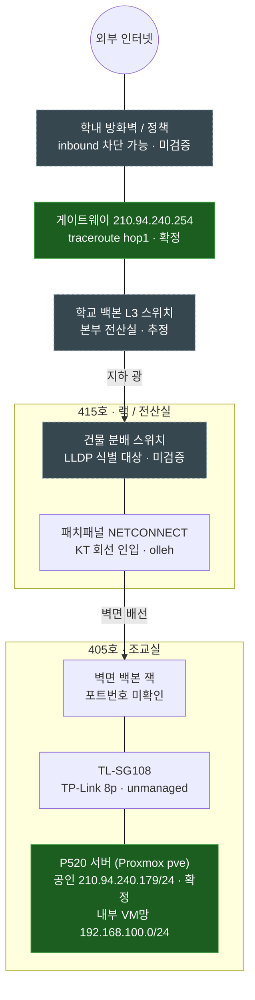

---
title: "SU Cloud — 캠퍼스 네트워크 구조 (초안)"
type: "raw"
date: 2026-06-28
tags: ["#raw", "#inbox"]
status: "raw"
source: "notion-export"
promoted_to: ""
---
# SU Cloud — 캠퍼스 네트워크 구조 (초안)

> **목적**: 운영계 후보 **P520**(405호)에서 출발해 `TL-SG108 → 벽면 잭 → 415호 랙 → 백본 → gateway .254 → 외부`로 이어지는 물리·논리 경로를 한 장으로 정리한다.
**상태**: 초안 · 사진/현장 스크린샷 기반. teal=측정 확정, 회색 점선=검증 대상.
> 

---

## 0. 한눈에 (TL;DR)

| 항목 | 값 | 상태 |
| --- | --- | --- |
| 대상 서버 | **P520** (Lenovo ThinkStation, Proxmox `pve`) | ✅ 사진·라벨 |
| 위치 | 1실습관 **405호 조교실** | ✅ |
| 랙/전산실 | 1실습관 **415호** (분배 스위치·패치패널·KT) | ✅ |
| 호스트 공인 IP | `210.94.240.179` / `255.255.255.0` | ✅ `ip route`, `arp-scan` |
| Gateway | `210.94.240.254` | ✅ traceroute hop1 |
| 할당 공인 IP | `210.94.240.179~180` (2개) | ✅ 전산실 제공 |
| 내부 VM망 | `192.168.100.0/24` (Proxmox vmbr1) | ✅ 스크린샷 |
| 외부 도달성(out) | `8.8.8.8` traceroute/mtr 정상, Loss 0% | ✅ |

> 🔸 별개 스코프: **개발계 Gaming5** = `10.20.110.0/24 VLAN 110`. 이 문서는 **운영계(P520, 공인망)** 만 다룬다.
> 

---

## 1. 구조도



### ASCII 요약 (fallback)

```
405호 조교실                       415호 랙              백본/관문        외부
───────────                       ────────             ────────        ────
P520(pve) ── TL-SG108 ── 벽면잭 ── [분배 스위치]─광─[백본L3]─ .254 ─[방화벽]─ 인터넷
.179/.24                  └ L2 (traceroute 안 보임) ┘   └ hop1 ┘   └ inbound? ┘
                          ↑ LLDP로 식별                            ↑ 외부 vantage로 검증
```

---

## 2. 확정 vs 검증 대상

### ✅ 확정 (측정값)

| 항목 | 근거 |
| --- | --- |
| P520 공인 `.179/24`, GW `.254` | `ip route`, `arp-scan` |
| 게이트웨이 = traceroute hop1 | `traceroute -n 8.8.8.8` |
| 내부 VM망 `192.168.100.0/24` | Proxmox vmbr1 스크린샷 |
| 외부 아웃바운드 정상 (Loss 0%) | `mtr` |

### ⬜ 검증 대상 (점선)

| 항목 | 확인 방법 |
| --- | --- |
| 415호 분배 스위치 — 스위치명/포트 | `lldpctl` (L2라 traceroute엔 안 잡힘) |
| 그 포트가 access vs trunk, 운영계 VLAN 포함 여부 | LLDP PVID / `tcpdump` VLAN 태그 |
| inbound: 외부 → `.179/.180` 도달 | **캠퍼스망 밖** vantage에서 검증 |
| 백본 L3 hop 구성 | traceroute (현재는 추정) |
| 405↔415 벽면 배선 포트 매핑 | 패치패널 라벨(22·23·24 / 44·45·46) 현장 대조 |

---

## 3. 핵심 개념 메모

> **traceroute / mtr는 L3(IP) hop만 본다.** TL-SG108·랙 L2 스위치는 TTL을 감소시키지 않으므로 hop으로 안 나타난다. 그래서 hop1이 바로 `.254`(gateway)로 나온다. 조교실~랙 물리 구간은 **L2 도구(LLDP / ARP)** 로 따로 본다.
> 

| 보고 싶은 것 | 도구 |
| --- | --- |
| 외부 L3 경로 | `traceroute`, `mtr` |
| 바로 위 L2 스위치 | `lldpctl`, `tcpdump` |
| 같은 L2 이웃 | `ip neigh`, `arp-scan -l` |
| `.179/.180` inbound | 외부 vantage |
| 호스트 NAT 경로 | `conntrack`, `iptables -t nat` |

---

## 4. 다음 액션

- [ ]  405호에서 `lldpctl`로 분배 스위치명·포트ID 확정 → 점선 박스 채우기
- [ ]  해당 포트 access/trunk 판별 (운영계 VLAN 같은 포트로 오는지)
- [ ]  외부에서 `.179/.180` inbound 도달성 테스트
- [ ]  패치패널 라벨 ↔ 벽면 잭 포트 매핑표 작성
- [ ]  확정된 토폴로지 → Kolla-Ansible `globals.yml` (`network_interface`, `neutron_external_interface`) 반영